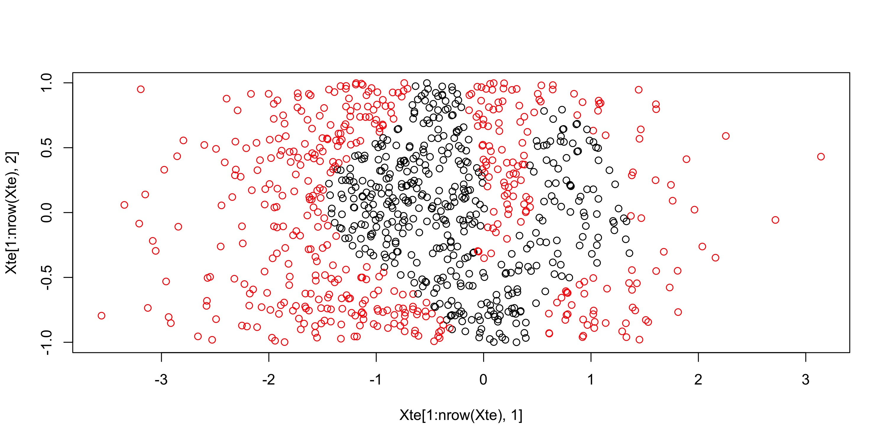

```{r setup, include=FALSE}
knitr::opts_chunk$set(warning = FALSE, message = FALSE)
```

# Support vector machines

The assignment is concerned with the analysis of the optimization problems entailed by the usage of a support vector machine as a classification algorithm.

The primal formulation of the SVM is implemented in AMPL as follows.

```{r svmprimal, echo=FALSE, results="markup", comment=""}
cat(readLines("SVM.mod"),sep="\n")
```
The dual, on the other hand, is implemented as follows.

```{r svmdual, echo=FALSE, results="markup", comment=""}
cat(readLines("DualSVM.mod"),sep="\n")
```

In the dual model, the `.run` file is slightly more complex because the primal solution must be retrieved from the dual model.

Given the dual solution vector $\mathbf{\lambda}$, the primal solution $\mathbf{w}$ is found as
$w_j = \sum_{i=1}^m \lambda_i y_i A_{ij}$.

The plane intercept $\gamma$, on the other hand, is found exploiting complementary slackness.
Since $\lambda_i (y_i (\mathbf{w}^T \mathbf{x}_i + \gamma) - 1 + \zeta_i) = 0$, when a point $k$ is a non-bound support vector we have $\lambda_k \in (0, \nu) \implies \zeta_k = 0$ and therefore $\gamma = \frac{1}{y_k} - \mathbf{w}^T \mathbf{x}_i$.

Since the solution is found numerically, the condition $\lambda_k \in (0, \nu)$ is checked with some slack $\epsilon$ to counter numerical errors in the computation.

This results in the following AMPL code.

```{r svmdualrun, echo=FALSE, results="markup", comment=""}
cat(readLines("DualSVM.run"),sep="\n")
```

Finally, we implement the dual formulation using the Gaussian kernel, substituting the dot products between data points with the kernel function $k(\mathbf{x}, \mathbf{x'}) = e^\frac{-\|\mathbf{x} - \mathbf{x'}\|}{\sigma^2}$.

In order to optimize the computation, we pre-compute the kernel matrix $K : (K_{ij}) = k(\mathbf{x}_i, \mathbf{x}_j)$.

Finally, after reviewing the relevant literature (@poggio_b_2002) we set the gamma parameter to zero, resulting in the following cod for the model

```{r svmgaussian, echo=FALSE, results="markup", comment=""}
cat(readLines("GaussianSVM.mod"),sep="\n")
```

and the following for the run script

```{r svmgaussianrun, echo=FALSE, results="markup", comment=""}
cat(readLines("GaussianSVM.run"),sep="\n")
```

# Computational study

## gensvmdat

We now run the primal and dual formulation of the SVM on the same dataset, generated with the provided `gensvmdat` program, then retrieve the primal solution from the dual as$w_j = \sum_{i=1}^m \lambda_i y_i A_{ij}$.
We will then check that the primal and dual solutions are the same.

```{bash, engine.opts='-l', echo=FALSE}
AMPL_PATH="/Applications/ampl_macos64:$HOME/ampl/ampl_linux-intel64/"
NUM_PARAM=4
TR_SEED=50321
TE_SEED=12305
TRAIN_FNAME="train_50.dat"
INPUT_FNAME="train.dat"
NU=0.5
# Remove asterisks
sed -i ''  -e 's/\*//g'  ${TRAIN_FNAME}
cp ${TRAIN_FNAME} ${INPUT_FNAME}
export PATH=${PATH}:${AMPL_PATH}
m=50
echo "m = ${m}, nu = ${NU}, Primal SVM:"
printf "${NUM_PARAM}\n${m}\n${NU}" | ./SVM.run | tail -n $(expr ${NUM_PARAM} + 1)
echo "m = ${m}, nu = ${NU}, Dual SVM:"
printf "${NUM_PARAM}\n${m}\n${NU}" | ./DualSVM.run | tail -n $(expr ${NUM_PARAM} + 1) | tee out_train_50.dat
rm ${INPUT_FNAME}
```

We can see that both the primal and dual SVM obtain the same parameter vector $\mathbf{w}$.
This is expected because the SVM, as a quadratic problem, benefits from strong duality, which means that the primal and dual solutions will be the same.

We will now test that this holds on a bigger dataset. Moreover, we will test the accuracy of the obtained parameter vector on a test set that is different from the training set.

```{bash, engine.opts='-l', echo=FALSE}
AMPL_PATH="/Applications/ampl_macos64:$HOME/ampl/ampl_linux-intel64"
PATH=${PATH}:${AMPL_PATH}
NUM_PARAM=4
TR_SEED=50321
TE_SEED=12305
TRAIN_FNAME="train_2000.dat"
INPUT_FNAME="train.dat"
NU=0.5
NUM_DATA_PT=2000
cp ${TRAIN_FNAME} ${INPUT_FNAME}
# Remove asterisks
sed -i ''  -e 's/\*//g' ${INPUT_FNAME}
echo "m = ${NUM_DATA_PT}, nu = ${NU}, Primal SVM:"
echo -e "${NUM_PARAM}\n${NUM_DATA_PT}\n${NU}" | ./SVM.run | tail -n ${NUM_PARAM}
echo "m = ${NUM_DATA_PT}, nu = ${NU}, Dual SVM:"
echo -e "${NUM_PARAM}\n${NUM_DATA_PT}\n${NU}" | ./DualSVM.run | tail -n ${NUM_PARAM}
rm ${INPUT_FNAME}
```

Again, the parameter vectors which result from solving the primal and dual problems are the same.
In order to classify a point, we now only need to see on which side of the hyperplane does it fall, that is if $\mathbf{w}^T \mathbf{x} + \gamma > 0$.

```{r solvesvmfunc, echo=FALSE, results="markup", comment=""}
parse_ampl_out <- function(param_file_name) {
  w = c()
  con = file(param_file_name, "r")
  gamma = as.numeric(strsplit(readLines(con, n = 1), " ")[[1]][3])
    while (TRUE) {
      line = readLines(con, n = 1)
      if (length(line) == 0) {
        break
      }
      w = unlist(c(w, as.numeric(strsplit(line, " ")[[1]][3])))
    }
  params <- list("w" = w, "gamma" = gamma)
}

get_svm_accuracy <- function(data_file_name, w, gamma, num_features) {
  data <- read.table(data_file_name)
  nts <- 0
  ncor <- 0
  for (i in 1:nrow(data)) {
    y <- t(w) %*% as.numeric(data[i, 1:num_features]) + gamma > 0
    nts <- nts + 1
    if ((y == TRUE &&  data[i, num_features+1] == 1) || (y == FALSE &&  data[i, num_features+1] != 1)) {
      ncor <- ncor + 1
    }
  }
  acc <- c(ncor, nts)
}

classify <- function(data_file_name, w, gamma, num_features) {
  data <- read.table(data_file_name)
  data["predict"] <- apply(df, 1, function(x) t(w) %*% as.numeric(x[1:num_features]) + gamma > 0)
  data
}
```

```{r solvesvm, echo=FALSE, results="markup", comment=""}
PARAM_FILE_NAME = "out_train_50.dat"
DATA_FILE_NAME = "train_50.dat"
params <- parse_ampl_out(PARAM_FILE_NAME)
w = params$w
gamma = params$gamma
cat ("w = ", w, "\n")
cat("gamma = ", gamma, "\n")
svm_acc <- get_svm_accuracy(DATA_FILE_NAME, w, gamma, 4)
ncor <- svm_acc[1]
nts <- svm_acc[2]
cat("Correctly classified", ncor, "/", nts, " points on the training set", "\n")
```

We can see that, on a dataset of 50 points, the trained SVM is able to correctly classify 9499 of the, or about 95%.

## Rice varieties dataset

We will now test the primal and dual formulations on a dataset concerning varieties of rice,  in order to ensure that, as expected, primal and dual formulations of the SVM give the same results.
We will also test an SVM which uses a  Gaussian kernel on it, and show that it gives a worse separation than the linear classifier.


```{bash, engine.opts='-l', echo=FALSE}
AMPL_PATH="/Applications/ampl_macos64"
NUM_PARAM=7
TRAIN_FNAME="rice.dat"
INPUT_FNAME="train.dat"
DUAL_OUT_FNAME="dual_out.txt"
NU=0.5
# Remove asterisks
sed -i ''  -e 's/\*//g'  ${TRAIN_FNAME}
cp ${TRAIN_FNAME} ${INPUT_FNAME}
export PATH=${PATH}:${AMPL_PATH}
m=3809
echo "m = ${m}, nu = ${NU}, Primal SVM:"
time $(printf "${NUM_PARAM}\n${m}\n${NU}" | ./SVM.run | tail -n $(expr ${NUM_PARAM} + 1) > out_${TRAIN_FNAME})
cat out_$TRAIN_FNAME
echo "m = ${m}, nu = ${NU}, Dual SVM:"
time $(printf "${NUM_PARAM}\n${m}\n${NU}" | time ./DualSVM.run | tail -n ${NUM_PARAM} > ${DUAL_OUT_FNAME})
cat ${DUAL_OUT_FNAME}
rm ${DUAL_OUT_FNAME}
rm ${INPUT_FNAME}
```

We see that, on this dataset, both formulations yield the same result as before. However, in this case, there is a much higher number of data points so the dual formulation is much slower.

```{bash, engine.opts='-l', echo=FALSE}
AMPL_PATH="/Applications/ampl_macos64"
PATH=${PATH}:${AMPL_PATH}
NUM_PARAM=7
INPUT_FNAME="train.dat"
TRAIN_FNAME="rice.dat"
NUM_DATA_PT=3809
cp ${TRAIN_FNAME} ${INPUT_FNAME}
for NU in 0.1 0.5 1 5
do
  echo -e "${NUM_PARAM}\n${NUM_DATA_PT}\n${NU}" | ./SVM.run | tail -n $(expr ${NUM_PARAM} + 1) > out_nu${NU}_${TRAIN_FNAME}
done
rm ${INPUT_FNAME}
```

```{r testsvmrice, echo=FALSE, results="markup", comment=""}

for (nu in c(0.1, 0.5, 1, 5)) {
  paramfile <- paste("out_nu", nu, "_rice.dat", sep="")
  print(paramfile)
  params <- parse_ampl_out(paramfile)
  w = params$w
  gamma = params$gamma
  cat ("w = ", w, "\n")
  cat("gamma = ", gamma, "\n")

  datafile <- "rice.dat"
  svm_acc <- get_svm_accuracy(datafile, w, gamma, 7)
  ncor <- svm_acc[1]
  nts <- svm_acc[2]
  cat("Correctly classified", ncor, "/", nts, " points", "\n")
}
```

We can see that, even on this dataset, accuracy is very high across values of $\nu$ when using a linear classifier. However, it drops significantly when using a Gaussian kernel, as shown in the following plot.

```{r readdata, echo=FALSE}
data <- read.csv('test.csv', header=TRUE, sep=";")
data$nu <- as.factor(data$nu)
data$model <- as.factor(data$model)
levels(data$model)[levels(data$model)=="./DualSVM.run"] <- "Dual"
levels(data$model)[levels(data$model)=="./SVM.run"] <- "Primal"
levels(data$model)[levels(data$model)=="./GaussianSVM.run"] <- "Gaussian"

divide_string <- function(str) {
 str <- strsplit(str, ",")[[1]]
 round(as.numeric(str[1]) / as.numeric(str[2]), 3)
}
data$acc <- unlist(lapply(data$acc, divide_string))
```

```{r gaussianrice, echo=FALSE}
library(dplyr)
boxplot(acc ~ model, data = filter(data, dataset=='rice_test_50.dat'), col=1:10, xlab="Model", ylab="Accuracy")
```


## Generated dataset using R

We will now test the primal and dual formulations on a dataset generated using R.
This dataset will exhibit a high degree of nonlinearity, in order to exploit the capabilities of the Gaussian kernel later. 

```{r gendataset, echo=TRUE}
m <- 900
set.seed(5021)
df <- data.frame(x1 = round(rnorm(m, mean = -0.5, sd = 1), 4),
                 x2 = round(runif(m, min = -1, max = 1), 4))
#set radius and centers
radius <- 0.7 
radius_squared <- radius^2 
center_1 <- c(-0.7,0) 
center_2 <- c(0.7,0)
#classify points
df$y <- ifelse((df$x1-center_1[1])^2 + (df$x2-center_1[2])^2 < radius_squared|
                      (df$x1-center_2[1])^2 + (df$x2-center_2[2])^2 < radius_squared,
                    -1,1)
write.table(df, 'randgen.dat', row.names=FALSE, col.names=FALSE)
```

We will now plot the dataset, using two different colors to distinguish the two classes.

```{r plotdataset, echo=FALSE}
plot(df$x1, df$x2, col=as.factor(df$y))
```

We can see, even qualitatively, that a linear binary classifier is bound to be a poor fit to this kind of data. 

We will now fit a primal and dual SVM to this dataset.

```{bash, engine.opts='-l', echo=FALSE}
AMPL_PATH="/Applications/ampl_macos64:$HOME/ampl/ampl_linux-intel64"
NUM_PARAM=2
TRAIN_FNAME="randgen.dat"
INPUT_FNAME="train.dat"
DUAL_OUT_FNAME="dual_out.txt"
NU=0.01
cp ${TRAIN_FNAME} ${INPUT_FNAME}
export PATH=${PATH}:${AMPL_PATH}
m=900
echo "m = ${m}, nu = ${NU}, Primal SVM:"
time $(printf "${NUM_PARAM}\n${m}\n${NU}" | ./SVM.run | tail -n $(expr ${NUM_PARAM} + 1) > out_${TRAIN_FNAME})
cat out_$TRAIN_FNAME
echo "m = ${m}, nu = ${NU}, Dual SVM:"
time $(printf "${NUM_PARAM}\n${m}\n${NU}" | time ./DualSVM.run | tail -n $(expr ${NUM_PARAM} + 1) > ${DUAL_OUT_FNAME})
cat ${DUAL_OUT_FNAME}
rm ${DUAL_OUT_FNAME}
```

We see that, on this dataset, both formulations yield the same result as before. However, in this case, there is a  higher number of data points so the dual formulation is  slower.

```{bash, engine.opts='-l', echo=FALSE}
AMPL_PATH="/Applications/ampl_macos64:$HOME/ampl/ampl_linux-intel64"
PATH=${PATH}:${AMPL_PATH}
NUM_PARAM=2
INPUT_FNAME="train.dat"
TRAIN_FNAME="randgen.dat"
NUM_DATA_PT=900
cp ${TRAIN_FNAME} ${INPUT_FNAME}
for NU in 0.1 0.5 1 5
do
  echo -e "${NUM_PARAM}\n${NUM_DATA_PT}\n${NU}" | ./SVM.run | tail -n $(expr ${NUM_PARAM} + 1) > out_nu${NU}_${TRAIN_FNAME}
done
rm ${INPUT_FNAME}
```

```{r testsvmrandgen, echo=FALSE, results="markup", comment=""}

for (nu in c(0.1, 0.5, 1, 5)) {
  paramfile <- paste("out_nu", nu, "_randgen.dat", sep="")
  print(paramfile)
  params <- parse_ampl_out(paramfile)
  w = params$w
  gamma = params$gamma
  cat ("w = ", w, "\n")
  cat("gamma = ", gamma, "\n")

  datafile <- "randgen.dat"
  svm_acc <- get_svm_accuracy(datafile, w, gamma, 2)
  classified <- classify(datafile, w, gamma, 2)
  plot(classified$V1, classified$V2, col=ifelse(classified$predict, ifelse(classified$V3==1, "red", "pink"), ifelse(classified$V3==-1, "black", "gray")))
  ncor <- svm_acc[1]
  nts <- svm_acc[2]
  cat("Correctly classified", ncor, "/", nts, " points", "\n")
}
```

We can see that, on this dataset, accuracy is not very high across values of $\nu$ if a linear classifier is used.

Using Gaussian Kernel with $\sigma^2 = 0.1$ we obtain the following classification. This kernel transforms the data into an infinite-dimensional Hilbert space that allows the SVM to classify non-linear data in the original space. We knew in advance that this dataset would have been much better classified using this kernel as the data is not linearly separable.



A comprehensive and quantitative comparison will be performed in the following section.


# Computational study

After generating a .csv file with the outputs resulting from different datasets, varying the values of $\nu$, we will now observe variations in accuracy and CPU time across different formulations.
The accuracy tests are made on a test set which is different from that used for training, in order to evaluate the robustness of the fitted model.

## CPU time

First, we plot CPU time with respect to model formulation, primal and dual.

```{r cputime, echo = FALSE}
library(dplyr)
cputime_data <- read.csv('test_cputime.csv', header=TRUE, sep=";")
cputime_data$cputime <- as.integer(cputime_data$cputime)
cputime_data$num_features <- as.factor(cputime_data$num_features)
cputime_data$model <- as.factor(cputime_data$model)
levels(cputime_data$model)[levels(cputime_data$model)=="./DualSVM.run"] <- "Dual"
levels(cputime_data$model)[levels(cputime_data$model)=="./SVM.run"] <- "Primal"
dual_cputime <- filter(cputime_data, model=='Dual')
boxplot(cputime ~ model, data = cputime_data, xlab = "Model", ylab="CPU time (ms)", col = 10:15, outline=FALSE)
```

We can see that the dual formulation is much slower in general, even on a small dataset. This is expected because, on both datasets, $n >> d$ and the dual formulation is nonparametric, i.e. scales with dataset size and not parameter count.

We now plot CPU time of the dual formulation with respect to dataset size.

```{r cputimedual, echo = FALSE}
boxplot(cputime ~ num_features, data = dual_cputime, col =10:15, ylab="CPU time(ms)", xlab="Number of data points")
```

We can see that, as expected, the dual formulation scales badly with dataset size, matching the expected curve of $O(n^3)$.

Finally, we print CPU time of the primal formulation with respect to dataset size. A boxplot is hardly significant since, as we can see, CPU time is lower than 1 second. This also matches what is expected from the theoretical analysis, as the primal formulation does not scale with data set size.

```{r cputimeprim, echo = FALSE}
primal_cputime <- filter(cputime_data, model=='Primal')
print(select(primal_cputime, dataset,num_features,cputime))
```
## Accuracy and regularization

We now plot accuracy of the SVM with respect to $\nu$, for each dataset.

```{r accnu, echo = FALSE}

boxplot(acc ~ nu, data = filter(data, dataset == "test_50.dat"), xlab = "nu", ylab="Accuracy", col = 10:15, main = "gensvmdat", outline=FALSE)
boxplot(acc ~ nu, data = filter(data, dataset == "rice_test_50.dat"), xlab = "nu", ylab="Accuracy", col = 10:15, main = "Rice varieties", outline=FALSE)
boxplot(acc ~ nu, data = filter(data, dataset == "randgen_test_900.dat"), xlab = "nu", ylab="Accuracy", col = 10:15, main = "Generated using R", outline=FALSE)
```

We can see that median accuracy generally increases with $\nu$, topping out around the middle and then descending. 
The best values are $\nu \in \{1000, 10000\}$ for the `gensvmdat` dataset, $\nu = 10000$ for the rice varieties dataset, and $\nu \in \{0.001, 0.01, 0.1\}$ for the dataset generated using R.
The $\nu$ parameter can be interpreter as an inverse regularizer of the solution, which increases generalization power if low, but underfits if too low.

This means that the rice varieties and `gensvmdat` datasets have a very clear separation, even when differentiating between a training and test set, therefore, even the limit value of $\nu = \infty$ which translates to the hard-margin SVM, where separation is perfect but the model is wildly overfitting, is a good choice. The randomly-generated dataset, on the other hand, is 

## Gaussian kernel parameter

We now aggregate data with respect to $\nu$ and search for the best parameter $\sigma^2$ for the Gaussian kernel on the dataset randomly generated using R.

```{r accsigma, echo = FALSE}
library(dplyr)
boxplot(acc ~ sigmasq, data = filter(data, (sigmasq != 'n/a') & (dataset == "randgen_test_900.dat")), xlab = "Sigma^2", ylab="Accuracy", col = 10:15, outline=FALSE)
```

We can see that the value of $\sigma^2$ that provides the best results is $\sigma^2=0.01$.

Finally, we plot the accuracies of the three formulations on our generated dataset.

```{r accform, echo = FALSE}
boxplot(acc ~ model, data =filter(data, dataset == "randgen_test_900.dat") , xlab = "Model", ylab="Accuracy", col = 10:15, outline=FALSE)
```

We can clearly see that, as expected, median accuracy on a dataset which exhibits non-linear properties is much higher when using the Gaussian kernel. 

# Conclusions

Our implementations confirm the theoretical properties of the support vector machine, and prove that both the primal and dual formulation are able to obtain very high accuracies even off the training set if the cost parameter $\nu$ is well tuned.

We also see that using a Gaussian kernel allows us to maintain a high level of accuracy in the case where the dataset at hand presents nonlinearities. Again, this holds even using a test set different from the one the SVM is trained on.
However, this penalizes explainability of the model.
For example, we know that the dataset generated by the `gensvmdat` program separates data according to the $x_1 + x_2 + x_3 + x_4 - 2 = 0$ plane.
This is reflected in the coefficients of the primal and dual non-kernelized SVM, but not in the learned parameters for the Gaussian kernel.
Moreover, this outright damages accuracy in cases where the dataset is linearly separable.

All in all, this works confirms that the support vector machine is a powerful and flexible tool that can be applied to cases where data is scarce, which can perform well in a high-dimensional feature space through the kernel trick and learn non-linear patterns in the data at hand.

# References
